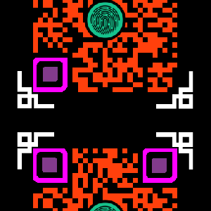

## CTF
都不会做
### 流量包 100分

由签到题可知flag格式包含ctf字段

```shell
strings 17010.pcapng | grep -i ctf
```


### 流量包 300分

直接用strings并没有直接找到明显flag字段。

binwalk看看，可以发现流量包中有zip包。


将zip分离出来

此处用binwalk -e分离出来的zip可进行正常爆破，但密码无法打开，如下命令则可以，此处卡了很久。

```shell
tcpxtract -f 7.pcapng
```


打开第一个压缩包发现为加密包，其中的txt文件非常小，只有2-3字节，故先用crc32爆破文本内容。


```shell
# 现场是直接用常规的crc32爆破脚本做的，后来发现个zip爆破脚本更加直接
# 爆破结果是key is 0f7fb579c1c2
# https://github.com/kmyk/zip-crc-cracker
# 注：要把脚本稍作修改，限定为只作用于size<=5才能直接使用
python3 crack.py 00001091.zip
```


也可以用普通脚本爆破：

```python
#!/usr/bin/env python
# coding=utf-8

import binascii

def crack():
    # 要爆破的crc集合
    crcs = set([0x8a90aba9, 0x503055ac, 0xb263a386, 0x045a975f, 0x5cef3f51])
    # 可见字符范围
    r = xrange(32, 127)
    # 爆破3字节的文本，其他字节自行调整脚本
    for a in r:
        for b in r:
            for c in r:
                    txt = chr(a) + chr(b) + chr(c)
                    crc = binascii.crc32(txt)
                    if (crc & 0xFFFFFFFF) in crcs:
                        print hex(crc & 0xFFFFFFFF), txt

if __name__ == "__main__":
    crack()
```

使用密码0f7fb579c1c2即可解压，然后会得到一个5.zip的压缩包。


其中birthday.zip是没有加密的，里头的png大概就是二维码了


这个地方我们又卡了很久，没有注意到文件名提示的生日，实际上就是8位密码的爆破：

```shell
crunch 8 8 -t 20%%%%%% > pass
fcrackzip -D -p pass -u birthday.zip
```


解压得到：



还要修二维码。。。photoshop+画图


### jsp 100分

sql注入漏洞，登陆即可

admin'||'1'<>'2

### 买东西  100分

条件竞争

用burp不断发买20的请求，然后手工点击重置即可成功购买到flag。

### XBOR 200分

```
JRGFYS2ZMR6C47D6FAWS6KLZPIWC27L2FV4SUKD5F4VS4JT2PYVXY6JJFUXHYYQ=
```

使用该工具包，可下载个离线版：[CyberChef](https://gchq.github.io/CyberChef)

先base32、再进行xor爆破。


### 助记词 200分

hint：区块链 钱包

安装一个钱包客户端，输入如下助记词并可以进入钱包回去到私钥。


### NES 300分

```
Round n part_encode->:
6aa90b3f72a6cd55d81776d239351034a24322a9dc4b9d2d7868435bc3d9a2d84d56716618252f3fff6f158566c98f050c4bee24d6ee05e1aa944029ca281e38e019458dbf6dee35f8db6564d8b716145a027ac988bab5d4d9e2eb56030390c4ca2d615fdb9fd3158e6388cb6e2f90bc34f99f2affa48146149695692299115ce1591e5d3f9c2954a03439749274ae5b53dbd2fc538b595454a698a3a8a95ea3e251d23c0e3692eaf76384bf390eff2381ee2ed72a073505016700fec5ef59e5f94539e7dbe91725c5044108cbb1ecd502b33b24fb04063f33b45bb09f55e7170405f9ddcd98c8e3b63d74002950f4cab9ea0b32c57fddd6ab70acb572e5615e45f950d6cecacd50ee2fd3facdd56b6ba57dd20e10049995d76f54add73da92cc96fe15cddc08a76af8648dc65ccf0277c6f0bdbdb3ecc40d06c6051a9fa99b4bc135de18966aaebcedacff7ae35f9ddf91cf983a01c0e9a90e11ac5b7f7f2f196726dad6b19ba58ff5c1e0ba4bdf66519090a3549ad74e8ac62ec24a1a0e36848601fef1334ca2bbbffc103168372a4f832ab55d37cebeb7705e502133fe74620bd9a76433a96f34f8a723f10e22a55f91bb9531af3fd676a44a3e6f21f2febc623019a06a40ad4ee2c333c9b964318060b43b4c00b0e35e421da7e079d533deb535aab84d7dc63bd51a1140ad1f5fb7a9c541d047fa4cbf762f82efe1dbea618c45fb9c783e09c946e40f585238e467f6f5c941e54f1345ddc7fbc7a18c7702ad2946e5f1a99f4a14a9f7aee2e4b880456bdbc7c9706e892bd02f244780a50835002a7e83d2241b2c783a08c6bc58c49cd4112ed7a41e259c33d5f70703b0d69fbd04bc9ef5ce3b4e07e5dbf494264508a3e337bd1814295a933dd195a84a3da9c413200758281f06edf297cc9303f6ce89afac5c838fc2fd33be92d6c480a3115a1fec5599b7dcfdee7462f7264121fa19f83621937a02a3e96b16fa949f2c56e3f0affa8312d1587166dac848e62d2665c54a473e887a99aafc29e2c2cc2538411b6be1385b2e8b8721143a702a136f29b14e7cf9d41ac471b0f024154904f01ffb00b0ffc5444f03731864c57df4ef822383aa23abba60595e44e9e701d25a3c4a476cf053e03991a00d092184eebeeb5332841371d1efc871b7c937328dc6d4ca08ba6dd6a149ef2103360033a17bc78879a4eda7364608556c426ada1342bd9c25d0f821688a621b12c748bceb807dd650b45c08a85d6ee4a24d06c319161d2f0956e7df2c78e5a85f4798e1af2d44c76ddb9908271af12a568bef0d255ebcdab8034a27ae44b761ed403264fa57eaa24bcd2722d6011a3d37e4e284f00734377c1d0c3c84d3249e985dc9410f67a5b57aff0a0d0da1b0f0db6e3bc8a4046c4840f2cc85cd8c8cf6244fe79a8f5f9ef274cb4b35d
key->:
NTM2NTAzQ0Q2Rjc2NjU3MjUzNzlERTRDNkY3NjZBRUQ1MzY1NjM0RkI1RTY2NTUy
```

猜测encode为des第n轮的中间密文，key位第n个中间密钥(base64解开后刚好48字节)，不会做。

## AWD


